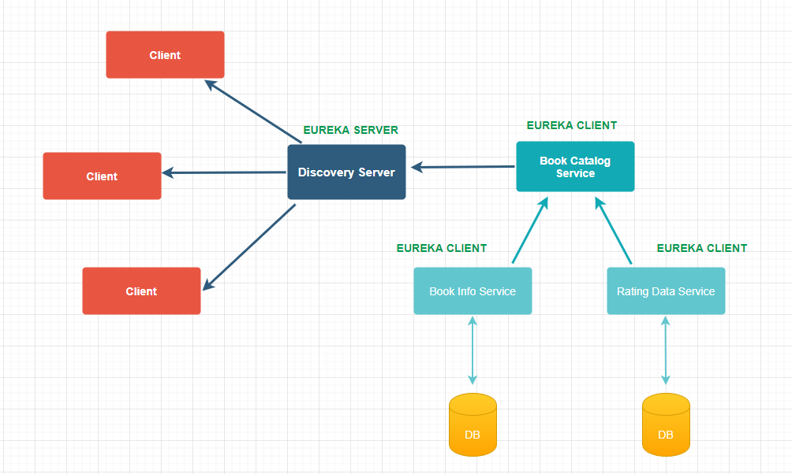

## Service discovery in a microservice architecture at Netflix
 
Client-side service discovery allows services to find and communicate with each other without hard-coding hostname and port.

###Spring Cloud Netflix – Eureka

- Eureka Server

    Implementing a Eureka Server for service registry
    * Adding `spring-cloud-starter-netflix-eureka-server` to the dependencies
    * Enable the Eureka Server in a @SpringBootApplication by annotating it with `@EnableEurekaServer`
    * Configure some properties
    
- Eureka Client

    Implementing a Eureka Client 
    * Adding `spring-cloud-starter-netflix-eureka-client` to the dependencies
    * Enable the Eureka Client in a @SpringBootApplication by annotating it with `@EnableEurekaClient`
    * Configure some properties         

- `RestTemplate` has been used in this example. But, neither `WebClient` or `Feign` can be used.





###Spring Cloud Netflix – Hystrix

- Hystrix

    Using the fault tolerance library as a `Hystrix` and implementing the `Circuit Breaker` pattern. Hystrix is watching methods for failing calls to related services. 
    If there is such a failure, it will open the circuit and forward the call to a fallback method.
    * Adding `spring-cloud-starter-hystrix` to the dependencies
    * Enable the fallback method in a `@Service` or `@Component` by annotating it with `@HystrixCommand`
    
        ```java
        @Service
        public class BookInfo {
        
            @Autowired
            private RestTemplate restTemplate;
        
            @HystrixCommand(fallbackMethod = "getFallbackCatalogItem")
            public Catalog getCatalogItem(Rating rating) {
                Book book = restTemplate.getForObject("http://book-info-service/books/" + rating.getBookId(), Book.class);
                return new Catalog(book.getName(), book.getDescription(), rating.getRating());
            }
        
            private Catalog getFallbackCatalogItem(Rating rating) {
                return new Catalog("Book name not", "", rating.getRating());
            }
        
        } 
        ```

    * Enable the `Circuit Breaker` in a @SpringBootApplication as a BookCatalogServiceApplication(rest consumer) by annotating it with `@EnableCircuitBreaker`
       
        ```java
        @SpringBootApplication
        @EnableEurekaClient
        @EnableCircuitBreaker
        public class BookCatalogServiceApplication {
        
            @LoadBalanced
            @Bean
            public RestTemplate getRestTemplate() {
                return new RestTemplate();
            }
            
        
            public static void main(String[] args) {
                SpringApplication.run(BookCatalogServiceApplication.class, args);
            }
        
        }
        ```    

- Hystrix Dashboard

    The feature of Hystrix is the ability to monitor its status on a dashboard.
    * Adding `spring-cloud-starter-hystrix-dashboard` and `spring-boot-starter-actuator` to the dependencies
    * Enable the monitoring in a @SpringBootApplication as a BookCatalogServiceApplication(rest consumer) by annotating it with `@EnableHystrixDashboard`    
    * It can be monitored on `localhost:8081/hystrix` 
    * It can be monitored API on `localhost:8081/actuator/hystrix.stream` 
        ```java
           @SpringBootApplication
           @EnableEurekaClient
           @EnableCircuitBreaker
           @EnableHystrixDashboard
           public class BookCatalogServiceApplication {
           
               @LoadBalanced
               @Bean
               public RestTemplate getRestTemplate() {
                   return new RestTemplate();
               }
               
           
               public static void main(String[] args) {
                   SpringApplication.run(BookCatalogServiceApplication.class, args);
               }
           
           }
         ```


TODO'S
------------------
###Spring Cloud Netflix – Zuul

###Spring Cloud Netflix – Chaos Monkey

 Example request: http://localhost:8081/catalog/glz


